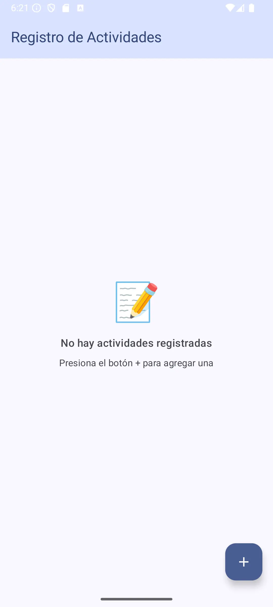
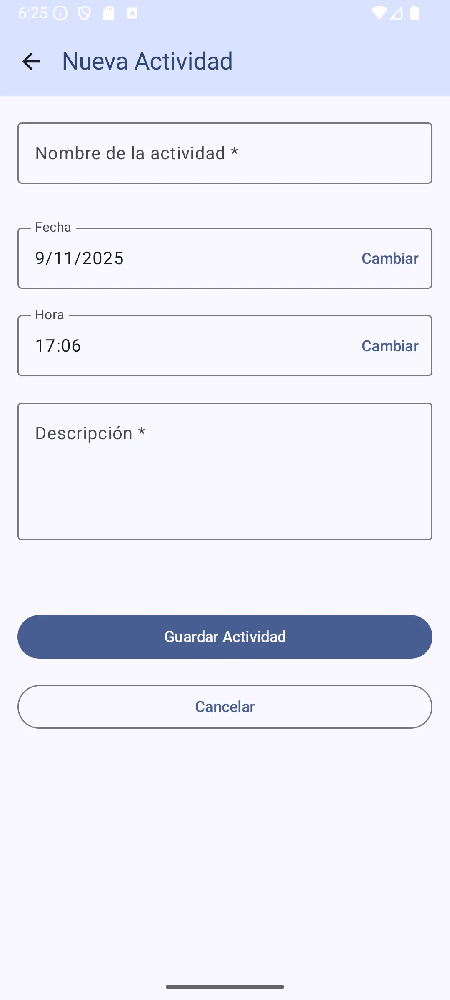
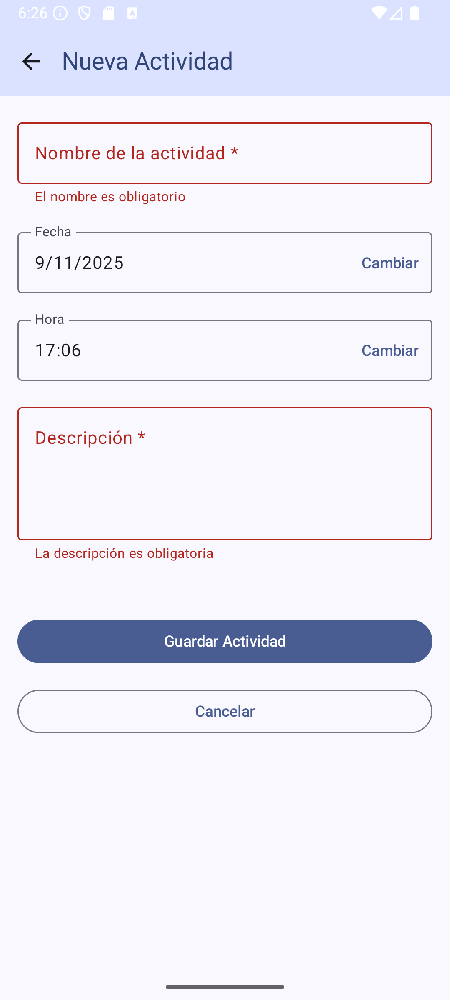
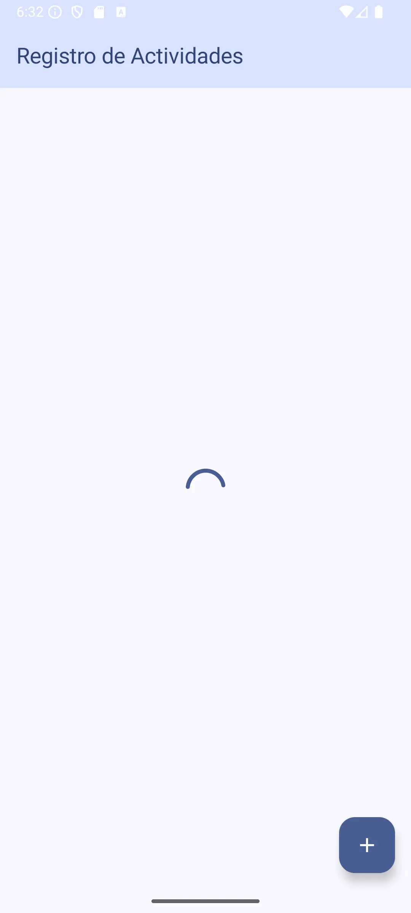
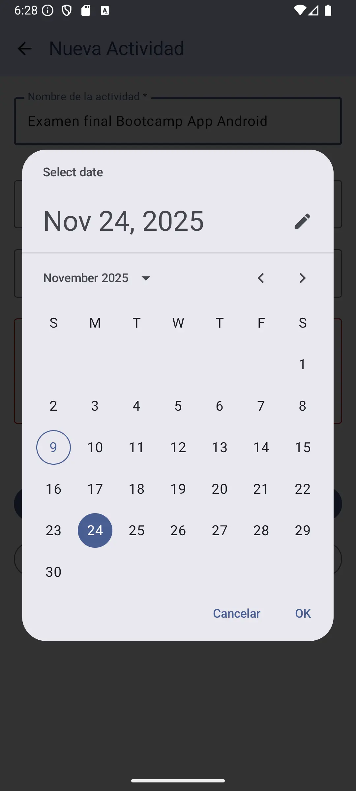
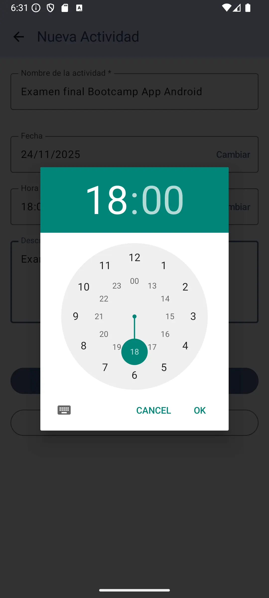
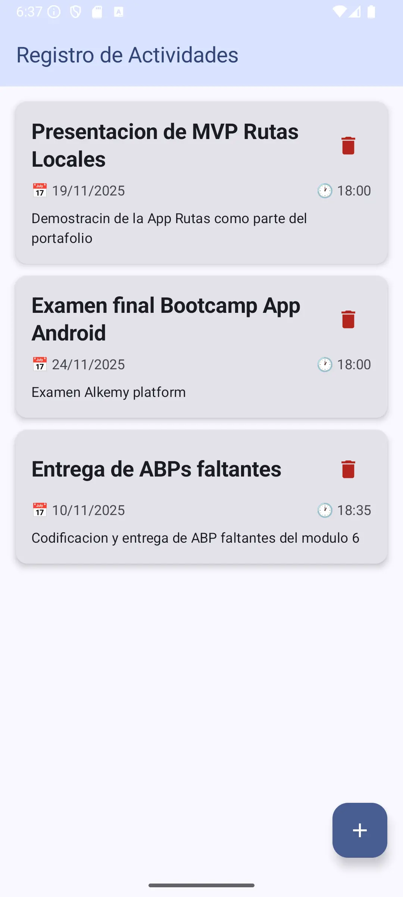
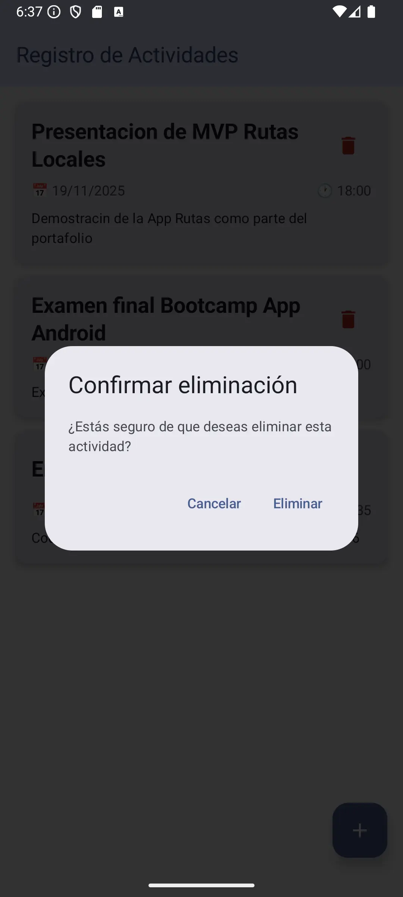
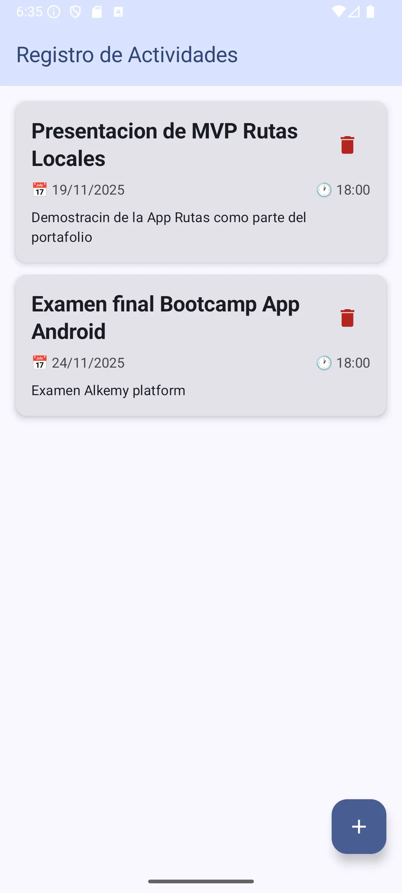

# 🏃‍♀️ ActivityApp

Aplicación Android nativa para registrar y gestionar actividades diarias.
Desarrollada con Kotlin, Jetpack Compose y arquitectura MVVM.
Diseño moderno, fluido y totalmente reactivo.

---

## ✨ Características principales

- ➕ **Agrega** actividades con título, descripción y horario
- 📋 **Lista y elimina** tus actividades fácilmente
- 🎨 **Animaciones suaves** con Jetpack Compose
- ⚡ **Estado reactivo** con `StateFlow` y `Coroutines`
- 🧭 **Navegación desacoplada** mediante `Navigation Compose`
- 📱 Diseño moderno basado en **Material Design 3**

---

## 🧩 Estructura del proyecto

| 🧱 **Componente**        | 💡 **Función principal**                            |
|---------------------------|----------------------------------------------------|
| `MainActivity`            | Inicializa Compose y el `ViewModel` global         |
| `ActivityViewModel`       | Gestiona la lógica, estado y coroutines            |
| `AppNavigation`           | Define las rutas entre pantallas                  |
| `ui/screens`              | Pantallas Compose (listado y formulario)           |
| `data/ActivityItem`       | Modelo de datos de actividad                      |

---

## 🛠️ Tecnologías utilizadas

- 💻 **Lenguaje:** Kotlin
- 🎨 **UI:** Jetpack Compose
- 🧠 **Arquitectura:** MVVM
- ⚙️ **Asincronía:** Coroutines + StateFlow
- 🧭 **Navegación:** Navigation Compose

---

## 🚀 Cómo ejecutar el proyecto

1. Clona este repositorio:
   ```bash
   git clone https://github.com/marglodis/activityapp.git
2. Abre el proyecto en Android Studio
3. Ejecuta en un emulador o dispositivo físico
3. ¡Empieza a registrar tus actividades diarias! 🗓️

### 🔄 Vistas de Interacción con la Aplicación

1. **Pantalla Principal y Formulario de Registro de Actividades**

<p float="left">
  
  
  
</p>

2. **Date and Time Picker, Circular Progress Indicator**

<p float="left">
  
  
  
</p>

3. **Pantalla con lista de actividades**
<p float="left">
  
  
  
</p>